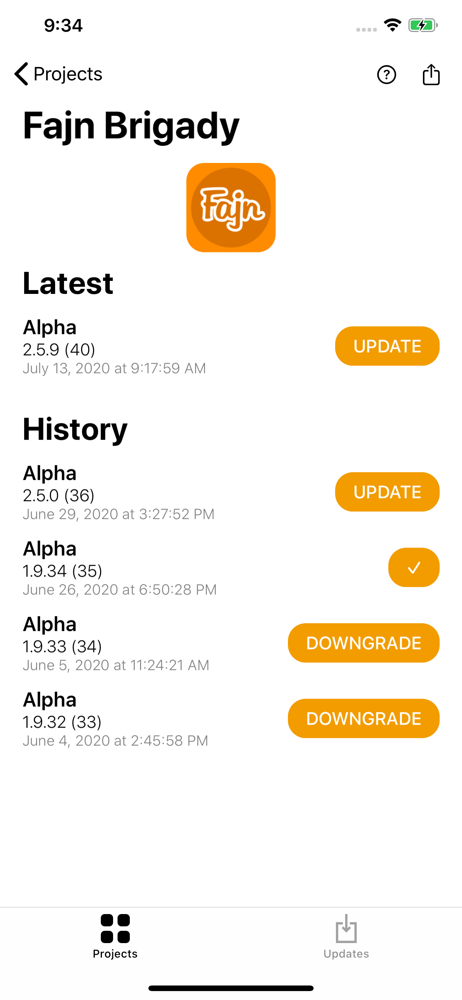

  

# In-House
In-House is a distribution platform for iOS system developed by SKOUMAL Studio, Libor Polehna. It allows us to distribute development phases such as Alpha, Beta, and Release versions (builds) of our projects without a complicated invitation process. The system is available for all members of the company and our clients.

# Motivation
As a studio company that has a variety of clients and projects, we would like to distribute our builds to our clients as simple and fast as possible. Many years ago, when we started it was a complicated process on iOS platform. It got better nowadays, however, it is still a little bit complicated from our perspective. When we want to use TestFlight as a distribution system we have to create new projects/apps for every version of a single application/project, such as Alpha, Beta, Release. Moreover, we have to send an invitation email to our clients to invite them the to AppStoreConnect system, and then another invitation to TestFlight. Therefore, we decided to develop our custom distribution system to provide a better solution that meets our company needs.

# Components
The system consists of:
- iOS app for our clients and internal members of the company.
- macOS App for projects management.
- Website (frontend) for installing applications without In-House application.
- Backend that stores the data and provides REST API. 
- Android extension for notifications (internal members of the company can receive notifications about iOS builds).

  

# Invitation Process
Tne invitation process is straightforward. We send a link to our clients. They will install our iOS application. Open the link. It is done, they can see ther applications and can install them. 

  

# iOS App
The main component of the system from the user's perspective is the iOS app. You can see projects and builds there. You can install, upgrade, or downgrade builds.
As you can see on the pictures, you can see all your projects or even the history of builds. Every project consists of alpha, beta, and release version. When a new build is available, all devices, with the appropriate permissions, receive a notification. Thus, clients are immediately notified.

  
  

# Website
Website frontend is a simple solution to give an option to our clients to install their applications without installing our iOS application. You do not need any invitation or access. You just have to know the URL that will be sent to you by the company.

  

# Backend
The backend keeps the data and provides the REST API, and simple web administration of our system. The API is used for the iOS application, macOS application, website frontend, and our automated build process.

The data structure that represents projects data is a hierarchical data structure, the composite. Therefore, any project can have subprojects. The depth is not limited.

  

# macOS App
The macOS app is used for managing the system and uploading the builds manually, if necessary.

  

There is a shared library/framework between the iOS and the macOS application that contains business logic, and network logic. Therefore, we can reuse this across Apple platforms without duplicating our code/logic.

  

# Technologies
- iOS
  - Swift, SwiftUI, UIKit, Runtime API of iOS system, Firebase, Custom frameworks for shared logic. 
- Backend
  - Python, Django, Django REST API, Firebase
- Firebase
  - Notification service mechanism

# Contact
For any inquiries, such as rebranding the system for your company, please contact skoumal@skoumal.com.
